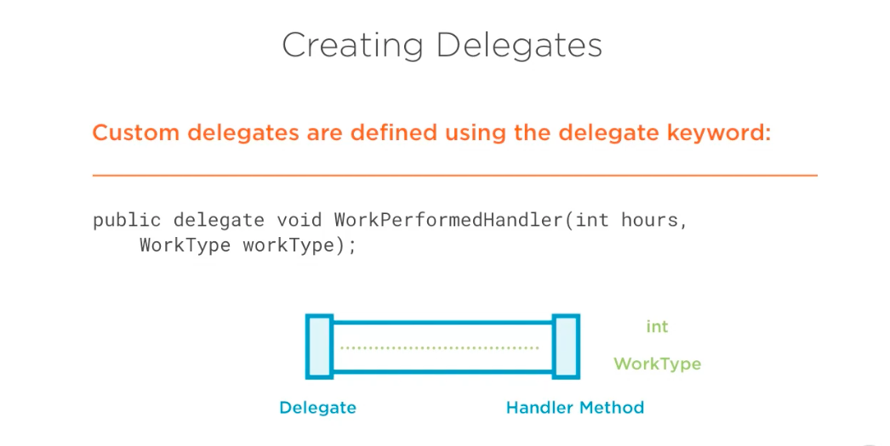
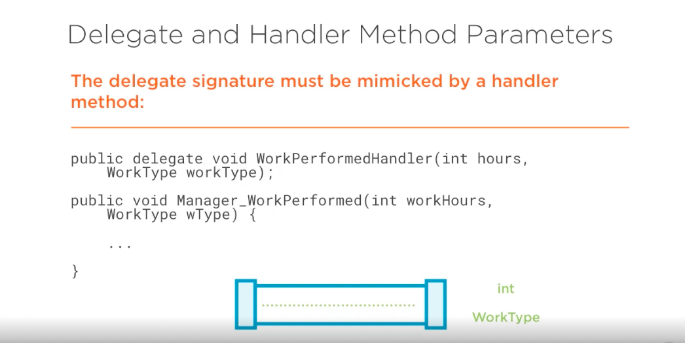
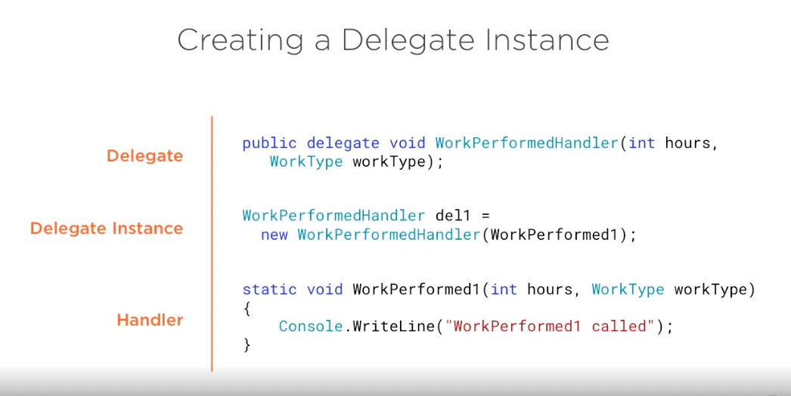
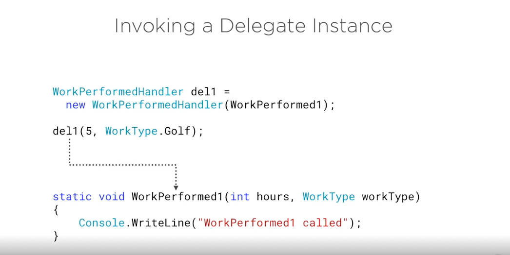
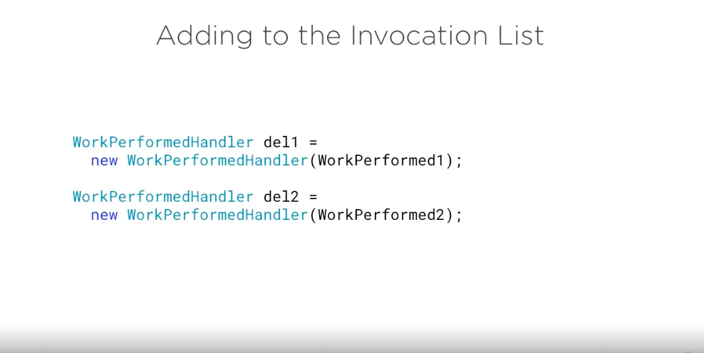

# Introduction to delegate #

- delegates are where it's at when it comes to messaging in the dotnet framework. Ain't time an event is involved? You're gonna have a delegate behind the scenes. Any time you want to dynamically invoke different methods, then you'll have a delegate that might be used behind the scenes. So in this section, we're gonna talk about more specifics on what delegates are, and I'm gonna demonstrate how to create custom delegates. Now, earlier, I showed the whole picture. We're just gonna focus, though, in this particular section on the actual delegate. Really? The pipeline between what was on the left here and the handler on the right. Now you notice I don't even have the word event handler or event are eggs up here for data And that's because delegates can stand on their own. You don't have to use delegates with events. So in this section, I'm gonna focus 100% on delegates. Then we'll tie events into it, and I'll show you how you can use delegates with events. Let's go ahead and jump in here to some more specifics on delegates. So when it comes to creating delegates, it's a very simple process. Actually, in essence. What you have to do is define a blueprint for an event handler or a handler. 

- Method will just say, since we don't necessarily, you have events here so accustomed delegate is defined by using the delegate keyword. Now this is kind of a magic key word, because behind the scenes, when the compiler sees the delegate keyword, it actually generates a class that inherits from some other dot net framework delegate classes and will be covering those in just a moment. So here's an example of a delegate, and you'll notice that I literally use the delegate keyword. This particular delegate is you could think of it as a one way pipeline. It's void so nothing gets returned back. Data only goes forward. The name of the delegate is work performed handler, and it takes an injure hours and a work type and work type is the parameter name, so work type could be something like an enumeration. Now, if you look at this and go, well, that's kind of interesting, because if I were to get rid of that delegate keyword, this literally looks like the shell for defining a method. The stub we could say and really it iss a delegate is a blueprint for the method. 

- That data is going to get dumped into the handler All column. And so, visually, it would look like this. The delegate is kind of the pipeline. And what we want, then, is a way to dump some data from point A over two point B, which is gonna be our handler method. So you could think of this is almost like a bin and the pipeline dumps into the bin. Now it's gonna happen is we have our data that is in our program somewhere, and we need to route that data over to this method. And so the way we're going to do that is will define the data that this pipeline can handle in the parameters here. No, In this case, the pipeline Onley accepts two parameters, and they must be of type int and type work type. If they're not, it won't compile. It won't work. And so now we have a way to delegate data from point A to point B. And if you think a delegation you can literally think of if you were to hire someone to go wash your car or wash your clothes or whatever it may be, you could delegate that responsibility or in programming terms, you might have a project manager that delegates Hey, you need to build the business layer or the data access layer. They're basically saying, Here's what I need Don. Now you go do it. Same process here. 

- The delegate simply knows how to pass data, as I showed here from point A over to the handler there, delegating the actual work to the handler method. So defining a delegate is very, very simple, as you can see here. Now let's look at what the handler method must do, though, in order for this to work. So delegate signatures as far as the parameters and handler method parameters must match up. So here's our delegate. And just as I showed earlier, we have our little pipeline. It accepts an end and work type. Now, when it comes to moving that data into a handler, the handler, obviously if it's gonna receive stuff out of this pipeline, must receive an ent and work type. So here would be an example of a handler method.

-  Now, notice that our delegate had an ent and therefore our handler must have an end notice that our delegate had as a second parameter of work type. And our handler that receives things from the pipeline must also have this. Now, this is really important to understand, because if you get the fact that there's only two things that can fit in this pipeline and if they do fit in the pipeline, the Onley thing, the only been I guess you could say it can dump into is something that has an ent and work type as a parameter type. Now the names here don't matter Now. I purposely name these different. This one was hours. This is work hours. This one is work type, and this is W type that is irrelevant. You could name those whatever you want. What matters is what the Arrow show here and that is the data types. Now what happens behind the scenes with our delegate? Well, it turns out dot Net has a couple abstract based classes that are used really no surprise there, cause that's pretty common in dot Net and one of the really core classes that provide some base functionality is called delegate. 

- Now it has to really important properties, the method and the target property. Now the method is the pipeline has to dump data somewhere, and you have to define the name of the method. Where that data should go now the target would be. If you have to have an object instance where that method lives, then the target would be the actual object that has that method. Now. There's also something called get invocation list now that ties into the next base class. There's a class called Multicast delegate that's built into the framework as well. Now every delegate you create, once it's compiled, will inherit from multicast delegate. And as I jump into the demonstrations here, I'll kind of prove that concept. So multicast delegate is really a way to hold multiple delegates. In other words, I might have one message I want to send out, but I might want to send it across multiple pipelines. So instead of just having the one like I showed earlier, a multicast delegate imagine it had multiple pipelines that dump in different methods. Now, your custom delegate is ultimately, as I mentioned, gonna inherit from multicast delegate. Now, this is not something you can do. 

- In fact, you can't inherit from delegate directly. And you can't inherit from multicast delegate directly. The way you do it is he used the delegate keyword. It's kind of a compiler trick these air very specific base classes that the compiler blocks from being drive from. Unless he used the delegate key work. Then once it sees that signature for your delegate method, it will automatically generated class that inherits from multicast Delegate. So what is multicast delegate? Well, just imagine a list. We're gonna call this the invocation list. I mentioned that delegate. The base has a get indication list. Well, imagine that I had a bunch of pipelines that dump in different places in a list. I literally said, Alright, Pipeline Juan goes to method one pipeline to dumps data and method to, and I literally make a list of these, as you see here. Well, that's called an invocation list. So a multicast delegate is really just an array of multiple pipelines, multiple delegates. Now the delegates, Then if we had, let's say two of these pipelines or delegates, what will happen is the order There in the list is the order their invoked. So if delegate one which calls Method one, is invoked first in the list. It will be called first, if delegate to follows it and it calls method to then it would go next. So it's a synchronous process, kind of from the top of the list to the bottom of the list. And if there's any heirs along the way, when invokes a delegate when I say when it meaning the dot net framework invokes, then an exception will be thrown. 

- And that's how the multicast delegate process works. Now that you've seen the base classes that are used behind the scenes with a custom delegate, let's switch our focus to How do we actually in Stan? She ate a delegate and use it to move data from some point over to another point once the delegates created and before we in Stan, she ate it. We need a handler. We need somewhere for that data to go. So in this case, I have one called work performed one, and it's gonna take RN Towers and work type now again as a reminder. Whatever the pipeline defines the delegate, the handler must also define as faras types go. So we have an ent and in it. And we have a work type in work type. Now, to actually hook up these two, we can new up our delegate. Now, recall that when the compiler sees the keyword delegate, it simply creates a class behind the scenes that inherits from multicast delegate. And so this will now be a class. And that's why we're gonna knew it up, just like we would. Any old class now noticing the constructor, though, we're gonna pass the handler that when this delicate is invoked, should be called. And so now work Perform. One will be called as this delegate is invoked. 

- Now, how do you actually invoke the delegate? Well, to invoke a delegate is actually very simple. You call it just like a method. So if I were to say, write some code to call work, perform one, you probably have no problem doing that. You'd say work performed one, puts in parentheses and passed the data. Well, now that we have a delegate, we just wanted ultimately behind the scenes to call war, perform one. So we simply invoke it just like we would a normal method. So you can see in this case that we have Dele one. We then invoke it like a method and now five will be passed in for hours and work type golf will be passed in for the work typing them and so that will invoke it dynamically at runtime. Very, very simple to do it. Now, at this point, although our delegate does inherit behind the scenes for multicast delegate, we only have one pipeline, one place to go, in other words, in the invocation list. So what if we wanted to add multiples in? Let's take a look at that. Well, here's an example of two delegates now, In this case, we have Dele won and we have dealt to and noticed that they 0.2 different functions here. Different methods work performed One work performed too. 

- Now we can imagine those look just like the other. I just showed Now what if we want? When delegate one is in Stan? She ate and invoked that it also invokes not only work performed one, but also work performed too. So it calls to things with just one call on our part. It would look like this we're gonna use is the plus equal syntax. So we have the plus equals operator, and we're gonna add in delegate to into the invocation list, which only has currently one item. And now when we invoke it, it'll actually pass five and go to meetings to both of these handlers. And so this provides a really flexible way tow wire up a bunch of notifications and then with one call, I can instantly notify, in this case, two different handler methods. So now that we've taken a look at how we can create delegates, the base classes behind the scenes, how we can in Stan, she ate and then invoke delegates. Let's jump into an actual demonstration and show you some code on how all this works together.

- Demo: Creating a Custom Delegate

- Let's look at the process for creating a custom delegate. So to start, I'm gonna come into this simple program just to console at I have. And we're gonna define a delegate Very similar what you saw earlier. So we'll just use the public key. Word will make a delegate. It's gonna be a one way. Which means data only goes forward through the pipe, and we can call this work performed handler. It'll taken in, which would be the hours. And then we can make a work type which I'll just throw together and Denham for that one in just a moment, and we'll call that lower case work type. 

- All right, so that would be our delicate definitions. Let me come down here and we'll just quickly make a public Denham called work type. And this could just have things like go to meetings. Maybe golf is part of work. That would be nice, actually. Generate reports and you get the idea. Okay, so that is all it takes to make a delegate. Let me slide this overseeing. See the whole thing Now what happens behind the scenes? Well, before I go any further and actually use this delegate. Let's go ahead and build. And now what I'm gonna do is use. I'll spy to actually open this. And so I'm gonna navigate to the path delegates and events E X e and let's open it up and see what we can see here. 

- Now, if you're not familiar really quickly here with I'll spy, you can go to I'll spy dot net right here. And this is a way we can basically disassembled code back to either i l intermediate language or all the way back to see Shark. And that's an option here for C Sharp VB and I'll. Well, we'll do C sharp. Here's my work perform handler, and if we click on it, it looks the same. But that's really not what's going on. I'll show you that in a moment, But let's look at the base type and there we have it. We can see it is inheriting from multicast delegate, and you might look at that and go well. How's it inheriting? There's not even a class there. Well, again, this is compiling back from ill to see sharp. If we actually go to the I l for this, then you'll notice we actually do have a work perform handler that extends multicast Delegate, This is the class. And so you don't see that with C Sharp. But behind the scenes, it truly is generating a actual class. OK, so that's our delegate. Now what do you do with the delegate? Well, let's come in. And let's say I had method down here and we'll just call this work performed one. And as I showed earlier, it's gonna have to take the exact same thing. 

- It's apples to apples. If I taken in here and work type here that I must taken in a work type now, name doesn't matter, but I'll go ahead and leave those the same and we'll just ride out council right line work performed one called and let's make another one of these. And I'm just gonna copy this and we have work performed one, and we're perform to called, and we could even ride out the hours and work type of we wanted. Now, how do we actually use the delegate to say I want to sand Ananda, Jer and work type into one of these methods? Well, we actually knew up in instance of it so I can say work performed handler, and that's our delegate type. You'll notice the little icon here for a delegate. We'll call this, uh, del one equals new or perform handler and look what it takes in the signature hair. It wants us to pass a method that is void and takes an int and work type. Well, just so happens we have two of those. How convenient. 

- So we'll go ahead and pass this guy in. And then let's set up one more hair. We'll call this Dell to, and this will be work performed, too. All right, now that just sets up the delegate. What we've now done is we've created a new pipeline and said this pipeline dumps its data here and then delegate to is another pipeline. It dumps its data here, so we'll obviously be invoking these guys. Now if I come on in, we can now invoke thes by saying Del one or Dell to and then invoke it. Just like you would is if he called a method so we could say del one and then parentheses. Look what it takes literally. We are now making a method call to whatever was defined here. So we're delegating this data right here to these different handlers. So in this case, let's say we had five and work type dot What? I wish I was doing golf. And this one will do DEL, too. 10 hours work type dot, Generate reports. All right, now, let's see if we can get this to work. 

- I'm gonna add a council dot reid here really quick. So it stays up and we'll run it, and it looks like it did work. Now, I can't really tell what the data was, though. So let's make sure that five was passed and 10 was passed. Well, if we come in here, let's go ahead and say hours to string and we'll just cut and paste that down. All right, let's run it again. And there we go. So you can see that we invoke the delegate. We passed in five to the first one. It actually routed that data to our work, performed one. Then we invoked the second delegate here. And as you can see, it did pass a value off 10. Now, when you look at this, you might say, Well, I don't really get wide. Even used this. So let's talk about that real quick. Well, let's say that we had a method, and this is going Teoh do some work, but it really doesn't know which work performed a call. We want to make it dynamic. I don't want a hard coded into this part of the program. 

- Which of these methods to call? So, as an example, I could say do work. Let's just say we had that. And then I could come down here and say Call work. Performed one. Let me just copy that up and pass in, You know, whatever I want. Well, now I'm hard coating that call. So it's not dynamic at all. Of course. Well, what I can do instead of hard coding this right here is what if we said hey passed me a work perform handler? We'll just call that delegate since we know it. ISS and then would have here. I actually invoke whatever was passed in here. And now pass it the data. So we'll do again. Five and four type, got golf or go to meetings, I guess. All right. So I'm gonna take this out, and what I'm gonna do here is we're gonna call, do work. We're gonna say, Hey, when you do the work, please use this delegate and we'll say Del one. Now we know that delegate one calls work performed one. And so now it's gonna happen. Is do work, gets the delegate. 

- Well, now it's gonna invoke whatever it was passed. And keep in mind, it doesn't even know what's going to be called at this point. Very dynamic. Imagine this was passed in May be from a totally separate object in your program, and that's where the power comes in. So now I'm gonna be passing five and go to meetings or golf or whatever I want to some unknown method. All I know is it takes it int and a work type. That's it. And so now when we run this, you'll see that work performed. One was called, and without changing this now, I could come to here and say, Let's pass delegate to run this And now we're performed to is called and that might have different calculations, different business rules, different, whatever it may be. So we're actually going to be using these coming up in the next section of this module more with events. 

- But I think it's really important to understand how first off, to define a delegate second, that behind the scenes that compiler actually generates a class that inherits from multicast delegate and then 3rd and 4th 3rd would be how you invoke it or ah created delegate, I should say and pass in the callback that should be invoked. And then how you actually invoke a delegate by using it just like a method, because the whole reason for the name delegate is were literally delegating functionality to some method. And that's where these can get really powerful. So that's an example of creating a custom delegate. What goes on behind the scenes with a compiler and how we can use delegates.