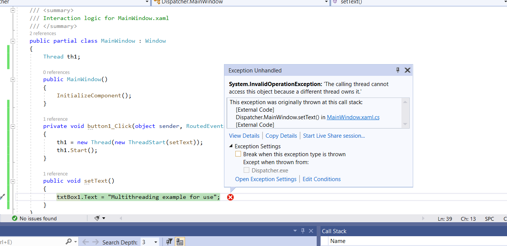

# What is dispatcher in WPF #
- A dispatcher is often used to invoke calls on another thread. An example would be if you have a background thread working, and you need to update the UI thread, you would need a dispatcher to do it.

- WPF is single threaded application.


# Code with issue #

```xml

 <Window x:Class="Dispatcher.MainWindow"
        xmlns="http://schemas.microsoft.com/winfx/2006/xaml/presentation"
        xmlns:x="http://schemas.microsoft.com/winfx/2006/xaml"
        xmlns:d="http://schemas.microsoft.com/expression/blend/2008"
        xmlns:mc="http://schemas.openxmlformats.org/markup-compatibility/2006"
        xmlns:local="clr-namespace:Dispatcher"
        mc:Ignorable="d"
        Title="MainWindow" Height="450" Width="800">
    <Grid>
        <Button x:Name="btn1" Content="Button" Click="button1_Click" HorizontalAlignment="Left" Margin="339,208,0,0" VerticalAlignment="Top" Width="75"/>
        <TextBox x:Name="txtBox1" HorizontalAlignment="Left" Height="23" Margin="320,150,0,0" TextWrapping="Wrap" VerticalAlignment="Top" Width="120" RenderTransformOrigin="0.123,1.31"/>

    </Grid>
</Window>
```

```c#

using System;
using System.Collections.Generic;
using System.Linq;
using System.Text;
using System.Threading;
using System.Threading.Tasks;
using System.Windows;
using System.Windows.Controls;
using System.Windows.Data;
using System.Windows.Documents;
using System.Windows.Input;
using System.Windows.Media;
using System.Windows.Media.Imaging;
using System.Windows.Navigation;
using System.Windows.Shapes;

namespace Dispatcher
{
    /// <summary>
    /// Interaction logic for MainWindow.xaml
    /// </summary>
    public partial class MainWindow : Window
    {
        Thread th1;

        public MainWindow()
        {
            InitializeComponent();
        }

        private void button1_Click(object sender, RoutedEventArgs e)
        {
            th1 = new Thread(new ThreadStart(setText));
            th1.Start();
        }

        public void setText()
        {
            txtBox1.Text = "Multithreading example for use";
        }
    }
}
```



# Source code with dispatcher to remove this issue #
```c#
<Window x:Class="Dispatcher.MainWindow"
        xmlns="http://schemas.microsoft.com/winfx/2006/xaml/presentation"
        xmlns:x="http://schemas.microsoft.com/winfx/2006/xaml"
        xmlns:d="http://schemas.microsoft.com/expression/blend/2008"
        xmlns:mc="http://schemas.openxmlformats.org/markup-compatibility/2006"
        xmlns:local="clr-namespace:Dispatcher"
        mc:Ignorable="d"
        Title="MainWindow" Height="450" Width="800">
    <Grid>
        <Button x:Name="btn1" Content="Button" Click="button1_Click" HorizontalAlignment="Left" Margin="339,208,0,0" VerticalAlignment="Top" Width="75"/>
        <TextBox x:Name="txtBox1" HorizontalAlignment="Left" Height="23" Margin="320,150,0,0" TextWrapping="Wrap" VerticalAlignment="Top" Width="120" RenderTransformOrigin="0.123,1.31"/>

    </Grid>
</Window>
```

```c#
using System;
using System.Collections.Generic;
using System.Linq;
using System.Text;
using System.Threading;
using System.Threading.Tasks;
using System.Windows;
using System.Windows.Controls;
using System.Windows.Data;
using System.Windows.Documents;
using System.Windows.Input;
using System.Windows.Media;
using System.Windows.Media.Imaging;
using System.Windows.Navigation;
using System.Windows.Shapes;

namespace Dispatcher
{
    /// <summary>
    /// Interaction logic for MainWindow.xaml
    /// </summary>
    public partial class MainWindow : Window
    {
        Thread th1;

        public MainWindow()
        {
            InitializeComponent();
        }

        private void button1_Click(object sender, RoutedEventArgs e)
        {
            th1 = new Thread(new ThreadStart(setText));
            th1.Start();
        }

        public void setText()
        {
            
            this.Dispatcher.Invoke(()=> { txtBox1.Text = "Multithreading example for use. "; }) ;
        }
    }
}
```
